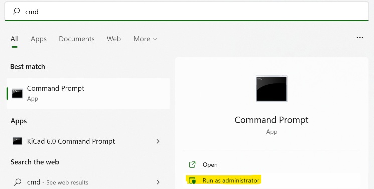
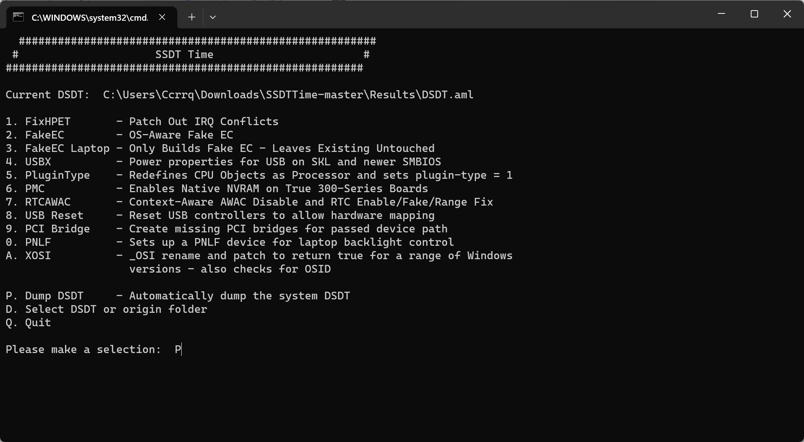
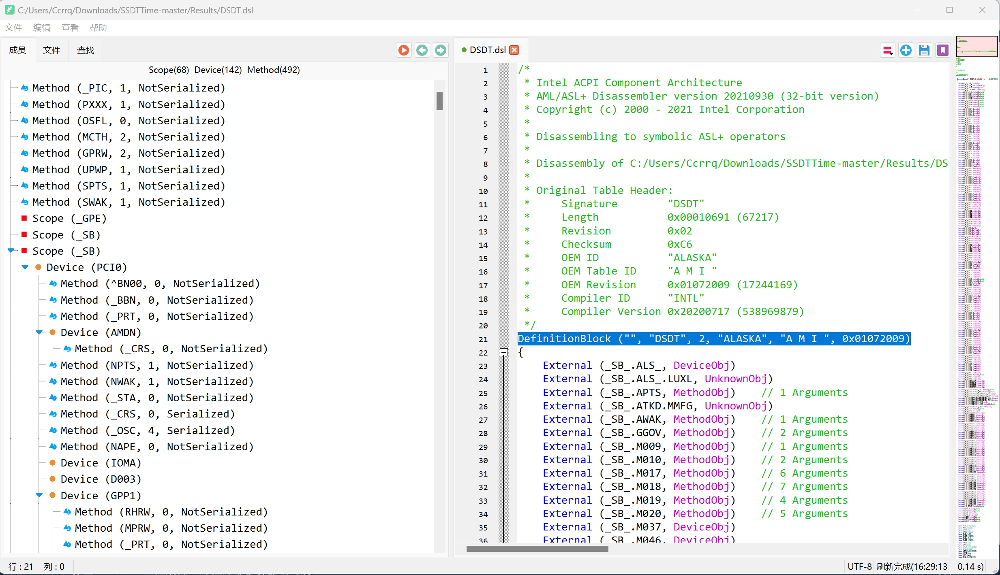
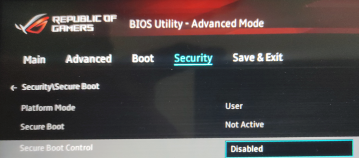
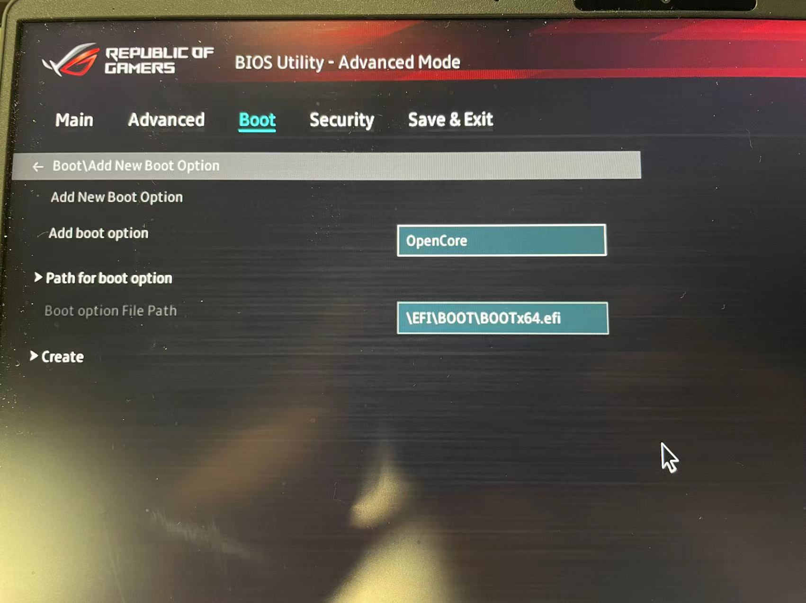
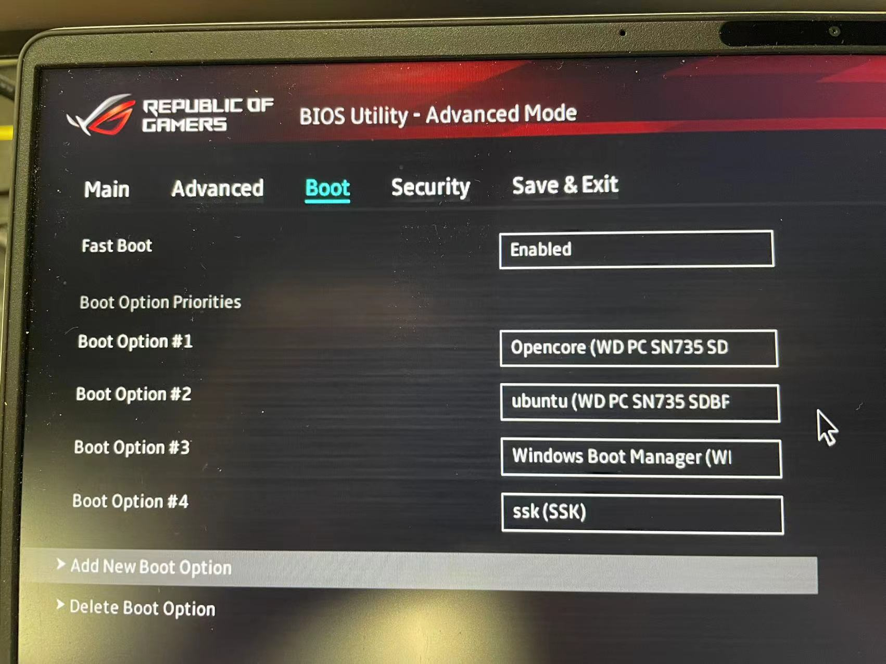
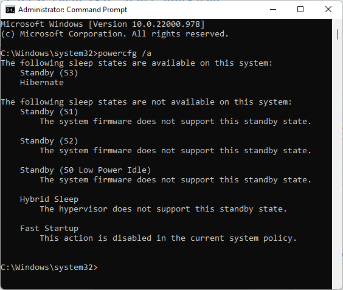
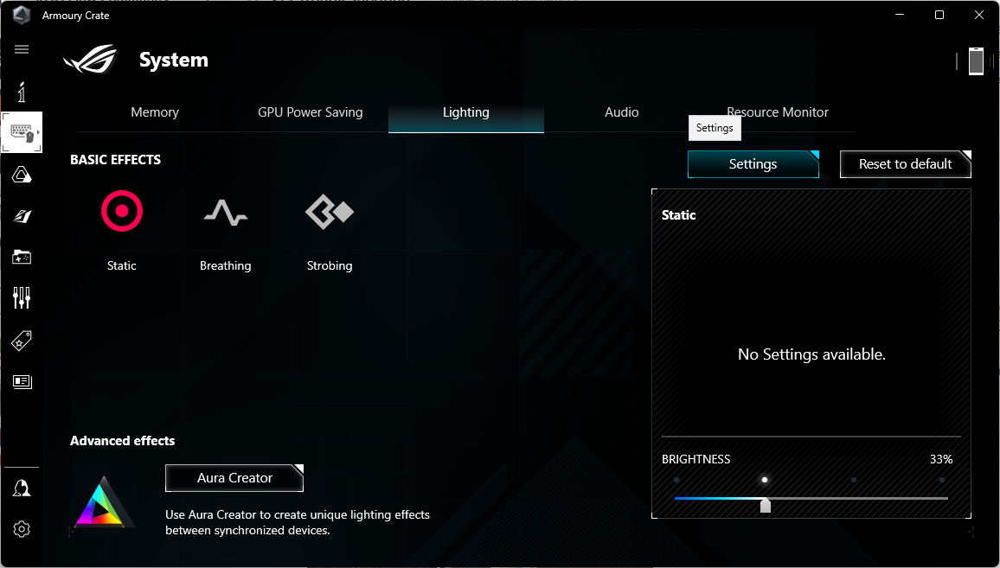
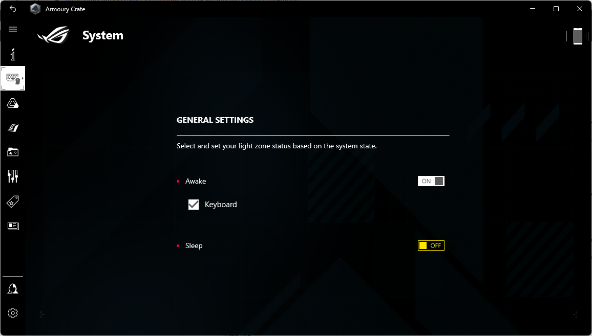

# Enable S3 Sleep on ROG X13/G14/15 2021/2022 using OpenCore
This tutorial helps you enable the hidden S3 sleeping mode on your laptop without modifying your BIOS. (Safest way, using OpenCore Bootloader)

Support tested : Asus ROG G14 2022 GA402RJ BIOS V312/318

Should be supporting: [Asus ROG X13 2021/2022](https://gist.github.com/raenye/d6645d7039a6136ccfb055e0f8517698)  /  [Asus ROG G14/G15 2021/2022](https://gitlab.com/marcaux/g14-2021-s3-dsdt)

This should be working for other models as well as the 2021/2023 models (and more, even more brands, you can test out, if not working you can simply choose the original boot option and delet the file I provided), you can test and share the results in dissucssion.

I've seen many disscussions on how to enable S3 sleep on the laptop. Some using RU to modify the BIOS, but it might cause a damage to the BIOS and that might be hard to recover for common users, also RU was [reportedly not working on the 2022 model](https://gist.github.com/raenye/d6645d7039a6136ccfb055e0f8517698#important=update). There are two more helpful works I read about, one using [Colver for ROG X13 (another hakintosh bootloader)](https://gist.github.com/raenye/d6645d7039a6136ccfb055e0f8517698) and [another](https://gitlab.com/marcaux/g14-2021-s3-dsdt) confirming modifying DSDT.aml could fix sleeping issues under linux (for 2021/2022 models and ROG G15 as well).

- [Introduction](#introduction)
- [Why Using OpenCore](#why-using-opencore)
- [Steps](#steps)
  - [Step 1: Disable S0 sleep under Windows](#step-1-disable-s0-sleep-under-windows)
  - [Step 2: Dump and Modify the DSDT file (under Windows)](#step-2-dump-and-modify-the-dsdt-file-under-windows)
  - [Step 3: Download and Install Opencore](#step-3-download-and-install-opencore)
  - [Step 4: BIOS settings](#step-4-bios-settings)
  - [Step 5: Restart and Boot Using OpenCore](#step-5-restart-and-boot-using-opencore)
  - [Step 6: Modify Power Plans in Control Panel](#step-6-modify-power-plans-in-control-panel)
  - [Step 7: Turn off flashing lights while sleeping](#step-7-turn-off-flashing-lights-while-sleeping)
- [Problem Solving: Battery Drain after Waking From Sleep](#problem-solving-battery-drain-after-waking-from-sleep)
- [Problem Solving: CPU Power Capped at 30 Watts After Using PD Charger](#cpu-power-capped-at-30-watts-after-using-pd-charger)
- [Extra Explanations for Hackintosh Users](#extra-explanations-for-hackintosh-users)
- [Easier Way?](#easier-way)
- [References](#references)

## Important note
When you update the BIOS, if you get a blue screen saying ACPI error, just select the origin windows boot option and redo Step 2 and replace the DSDT.aml file again in EFI partition.

## Introduction

As we know Microsoft has been asking OEMs to deliberately block the option of S3 sleep mode on laptops (especially those released in recent years) and force the users to use S0 Sleep mode instead.

>S0 Sleep Mode keeps the computer in a so-called low-power state (not truly sleeping) so it can quickly wake-up and response to external events, but it consumes more power, and there have been many reports saying their laptop has been overheating inside their backpacks, and even causing hardware damage.

>S3 Sleep Mode saves the system state to RAM, powers down most components for deeper power savings, but requires a slightly longer wake-up time (0.5-2 seconds) and the laptop won't automatically wake up when you lift the screen. You have to press a key or move your mouse to wake it up. But it prevents the laptop from overeating and also you don't need to fall into hibernation (which takes almost a whole precoess to boot up again, and often happens when your computer sleeps in S0 for long). What's more, it only uses very few battery life (less than 10% a day) when it's sleeping.

## Why Using OpenCore
The operation involves modifying one of the ACPI tables, called the DSDT. OpenCore is a morden and safer bootloader initially designed for hackintoshing, as a successor of Clover. Same as Clover, The modification is not permanent - nothing is written to the firmware itself - but rather through a bootloader that loads the modified DSDT before Windows starts. As I tested, the modification have run extremely stable on my G14 2022 (6900HS 6700S) for over a month, so I suggest using OpenCore (and you can even try installing hackintosh on you 2022 model, you can refer to [this post](https://github.com/b00t0x/ROG-Zephyrus-G14-GA402-Hackintosh)).

## Steps
### Step 1: Disable S0 sleep under Windows
*This part is referred from the [clover s3 sleep tutorial](https://gist.github.com/raenye/d6645d7039a6136ccfb055e0f8517698):*

Run Command Prompt as Admin.



To disable S0 sleep, type in the Admin Command Prompt:

```reg add HKLM\System\CurrentControlSet\Control\Power /v PlatformAoAcOverride /t REG_DWORD /d 0```

### Step 2: Dump and Modify the DSDT file (under Windows)
There are two tools you need to use:
1. [SSDTTime](https://github.com/corpnewt/SSDTTime) for dumping the DSDT table
2. [Xiasl]() for modifying the DSDT table

First you gonna download the __SSDTTime__ from the [link above](https://github.com/corpnewt/SSDTTime) and run the __SSDTTime.bat__ in that folder



Then type in "P" and press Enter, the output file would be located in the subfolder called Results

Download Xiasl Windows version (Xiasl-Win64.zip) from [this link](https://github.com/ic005k/Xiasl/releases)

Open the dunmped __DSDT.aml__ file using __Xiasl__ and the thins to be modified are on the right side

First find "__DefinitionBlock ("", "DSDT", 2, "ALASKA", "A M I ", 0x01072009)__" on top of the file

"__0x01072009__" is the version of file and could be different for different models. What you gonna do is increase the version, for example in this case, as hexadecimal is used here, you can change the last number from "__9__" into "__A__" which ends up looking like "__0x0107200A__"



Then press __ctrl+F__ and type "__(SS3, Zero)__" and press Enter, then you want to find and replace the "__Zero__" with "__One__" ----(SS3, One) ----IMPORTANT: you can try skip this step if things don't work properly, and only do the next replacement 

Then press __ctrl+F__ and type "__(XS3, Package (0x04)__", replace the "__XS3__" with "____S3___" ----(_S3, Package (0x04))


Then Press __Ctrl+M__ to compile the file, and the previous __DSDT.aml__ file would be overwritten in the same folder where it was, with the same name.

### Step 3: Download and Install Opencore
In this part, you gonna need to download [Expolrer++](https://explorerplusplus.com/) to help you move the bootloader files into your EFI partition. (64-bit suggested)

For your convenience, I've included a compitable OpenCore file in the project files. You can download the two folders (/OC and /BOOT). What you need to do is replace the __DSDT.aml__ file in __/OC/ACPI__ with your own modified one.

Then run Command Prompt as Admin again.


Run the command below:

>mountvol R: /s

Then go to the Explorer++ folder and  __RIGHTCLICK__ and open Explorer++ __as Administrator__.

Go to __R:\EFI__ and put the 2 folders into it.


### Step 4: BIOS settings
Reboot the computer and keep clicking the ESC button when the boot sound being played, and choose enter setup. Then press F7 to enter advanced mode and disable Secure boot.



Add the new Boot option:



Set it as #1 boot priority



### Step 5: Restart and Boot Using OpenCore
Reboot the computer and you would be booted into windows with S3 Sleep Mode enabled. You can use: 

>powercfg /a

>powercfg -a #If you're using powershell

In terminal to check if S3 sleep is enabled. Should be like this:



### Step 6: Modify Power Plans in Control Panel
Search Control Panel using system search function and change to Big Icon Mode(I don't know exactly the name cuz my windows is not running in English, but should be on the top right)

Then go to power management? (The battery Icon)

Then go to change plan setting - Advanced settings - Sleep

Disable Hybrid sleep and Hibernation and the last thing (don't know its Egnlish name sorry)

Then your sleeping should be OK!

### Step 7: Turn off flashing lights while sleeping
*This part is referred from the [clover s3 sleep tutorial](https://gist.github.com/raenye/d6645d7039a6136ccfb055e0f8517698):*

During S3 sleep, the power-on led on the left side double-blinks. If you're annoyed by the blinking led (and want to save a little bit more battery), this can be disabled in Armoury Crate->System->Lighting->Settings:





## Problem Solving: Battery Drain after Waking From Sleep
When you set your gpu mode to "__igpu only__" in Armoury Crate, you might notice that your battery drains very quickly after waking from both s0/s3 sleep. This is an long-existing bug/issue unsolved by Asus, which appears as an over 30 Watts power consumption after waking from sleep even if you open or run nothing. The problem was with the driver/control with the dgpu, which means __the computer's dgpu runs somehow in background even if in "igpu mode" set by Armoury Crate after waking from sleep__ (Hibernate/Reboot won't cause this).

There's temperory solutions. First is __use mixed mode__ instead of __igpu only__, currently the bug doesn't happen under this mode, and if you set power mode as silent, the dgpu hardly works, so doesn't matter. Second is __switch to mixed__ and then __back to igpu only__ everytime your laptop wake from sleep, this would stop the dgpu from draining your battery.

If you care much about power saving and expect the battery life to be as long as enough, it's suggested that you turn off sleep and only keep hibernation enabled.

## CPU Power Capped at 30 Watts After Using PD Charger
When you use a pd charger, you might find your cpu power capped at 30w even if you switch back to the DC (rounded one) charger. This is another long-exisiting bug ASUS never tried to fix. The way to solve it is to shut your computer with DC charger plugged, then unplug the charger for 5 mins. Then plug in the charger and boot your notebook. For me it solves the problem temperorily. If you want to get rid of this, you can buy a type c PD female to DC male adapter (Chinese name is pd诱骗器).

## Extra Explanations for Hackintosh Users
Everything's done from here. I'm only adding some explanations for hackintosh users who are worried about the SMBIOS influencing the windows.

I directly moded the EFI configured for G14 2022 hackintoshing by @b00t0x, but if you want to hackintosh the machine, I suggest you directly check [his project](https://github.com/b00t0x/ROG-Zephyrus-G14-GA402-Hackintosh) and mod the files provided there.

In [this](https://www.reddit.com/r/hackintosh/comments/lnh66w/windows_through_opencore_shows_as_macpro/?utm_source=share&utm_medium=ios_app&utm_name=iossmf) post, someone provided the way to avoid SMBIOS settings in OC to impact windows. If you want to build your own OpenCore bootloader, you can refer to this.

>If you boot Windows from OC, to prevent OC from injecting SMBIOS values to Windows you have to act on these keys in config.plist:
- Kernel> Quirks> CustomSMBIOSGuid> True (default is False)
- PlatformInfo> UpdateSMBIOSMode> Custom (default is Create).

## Easier Way?
By the way, OpenCore does have the function to directly find and replace contents in ACPI tables, but I have not tested if that's gonna work in this case. If it does, things would get even easier. Could anyone test and share the result?

## References
I'm listing the sources again at the end of this tutorial. Many thanks to those who provided the ideas and solutions in solving the problem!
- https://gist.github.com/raenye/d6645d7039a6136ccfb055e0f8517698#important=update
- https://gitlab.com/marcaux/g14-2021-s3-dsdt
- https://github.com/b00t0x/ROG-Zephyrus-G14-GA402-Hackintosh
- https://www.reddit.com/r/hackintosh/comments/lnh66w/windows_through_opencore_shows_as_macpro/?utm_source=share&utm_medium=ios_app&utm_name=iossmf
